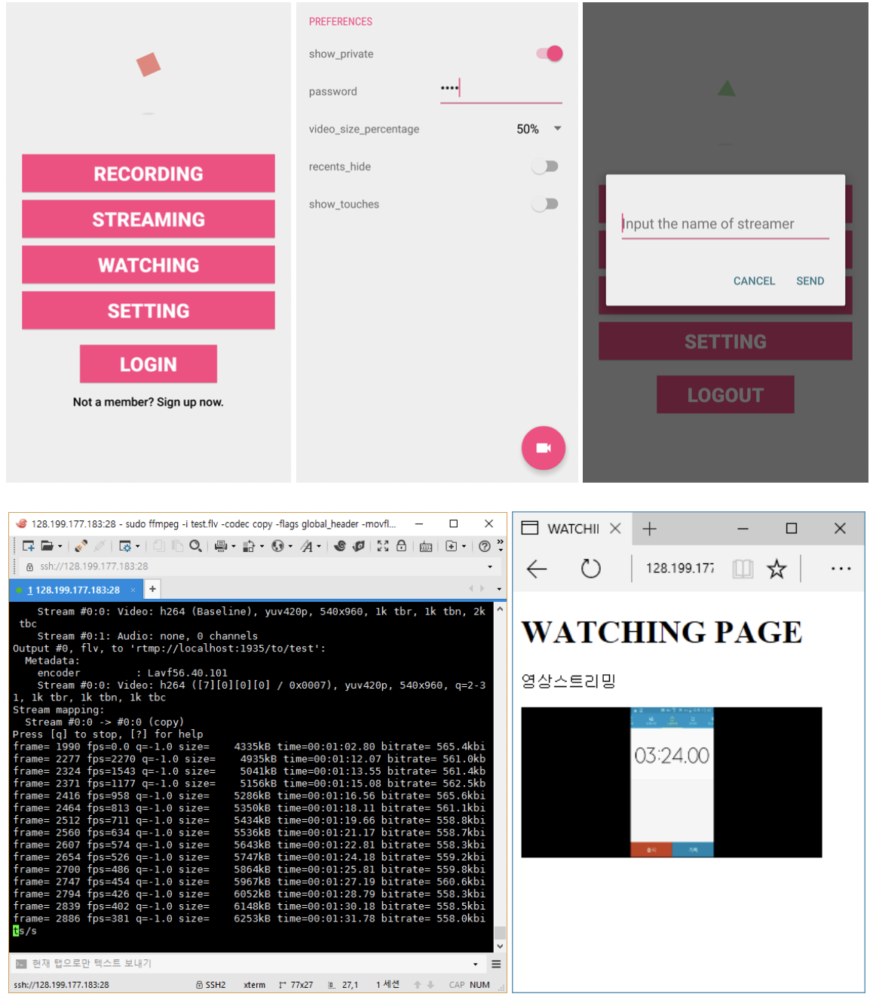
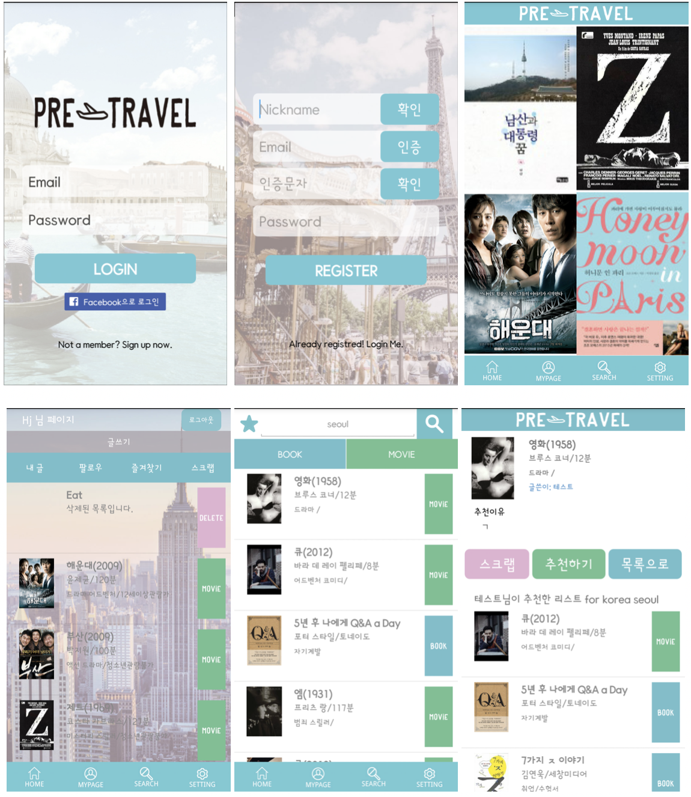

# Hyojin Kwak 

## Who am I

Mobile App Developer for 2 years (Android/iOS)

----

## Profile
* **Name** : Hyojin Kwak
* **Language** : 
    - Korean (Native)
    - English (Intermediate)  TOEIC 885

----

## Experience
- 01, 2017 - Present : [GE Appliances, a Haier Company](https://www.geappliances.com)(Pangyo, South Korea / Software Engineer - Mobile)
   - Reskinning / Redesigning the whole cafe app
   - Applying MVP, MVVM pattern
   - Converting Java project to Kotlin

    * 1B Appstore Facilitator

    * 1B Korea Hackathon
       - Won 2nd prize for the second
       - Won 3rd prize for the third

- 01, 2017 - 01-2019 : [Bankmedia Inc.](https://bankmedia.co.kr/)(Seoul, South Korea / Mobile Application Developer)
    - Developed both of Android and iOS applications which has 200K monthly active users. Built app for downloading and playing video. Converted Objective-C project to Swift.
    
- 09, 2014 - 11, 2014 : [Croatia Motorways Company(HAC)](http://hac.hr/en)(Zagreb, Croatia / Intern)
    - Tollgate server and toll collection system maintenance, and device management

- 02, 2014 - 08, 2014 : [Ahnlab Inc.](https://www.ahnlab.com/kr/site/main.do)(Pangyo, South Korea / Trainee)
    - IT Security Software testing.(Server/Client System, Common Criteria)

### Project
 - YESFILE/APPLEFILE DOWNLOAD APP: Android (Contributed 100%)
 
    Fabric standards 200k Monthly users, crush-free 99.6%. Android Application for downloading and playing video files. You can play and download the video file and management the files. FCM Marketing Push alarm. (in PlayStore/ Onestroe) 


 - YESFILE/APPLEFILE DOWNLOAD APP: iOS (Contributed 100%)

    iOS Application for downloading and playing video files. You can play and download the video file and management the files.


 - YESFILE/APPLEFILE SHORTCUT APP: Android (Contributed 100%)

    Android Application for Web shortcut which have player for on-demend mp4 streaming. app in onestore has fuction for in-app purcahse.(in PlayStore/ Onestore)

## Education
### Degree
- Korea University (2010.03 ~ 2017.02)
    - BS in [Computer and Information Science](http://kucis.korea.ac.kr) from [Science and Technology](http://st.korea.ac.kr)

### Personal Project

- MyRecorder :  Android / PHP Server (Contributed 100%)

    Android Application for recording the Android Screen to mp4 file and live streaming the Screen without rooting. When
    you push the watching button and input the streamer’s nickname, you can watch the live streaming from the streamer. and you can also watch the live streaming via web page.

- Pre-travel(미리여행): : Android/ PHP Server (Contributed 100%)

    This is a Android Application you can recommend and be recommended some book or movie about the place where you want to go or will travel. You can clip the book or movie contents you like and you can follow the person who posted the contents you like. When someone follows you or clicks likes button, you will get some push alarm. 

    

----

## Courses
* 04,09,2017 - 25,09, 2017 : [KIPFA](http://www.kipfa.or.kr/)
    -  [UX Director](http://www.kipfa.or.kr/Education/EduCenter/EduCenterView.aspx?eduSeqNo=995) 
        - Understand how users interact with your product.
        - Learn how to research a UX project, how to create wireframes, how to build user profiles & personas and so on.

* 05,07,2017 - 07,07,2017 : [KISA Academy](https://academy.kisa.or.kr/main.kisa) 
    - [[K-Shield Basic] Mobile Security Treats](https://academy.kisa.or.kr/edu/apply_detail.kisa?SQ=6869#)
        - Understand what is key point for mobile security.
        - Learn how to treat the mobile attacks by using K-Shield training contents. (Mobile payment terminal attacks, cracking scenarios in mobile application-android)
    

## Certification
* Engineer Computer System Application (Human Resources Development Service of Korea) 

* Linux Master 2nd (Korea Association for ICT Promotion)

----

## Skills
| Degree       | Description                                        |
|--------------|----------------------------------------------------|
| Beginner     | Getting started and still need support from others |
| Basic        | Can read and write code, but not yet comfortable   |
| Intermediate | Fairly comfortable, though at times need to reference Google or Stack Overflow |
| Advanced     | Able to teach or advise others                     |
| Expert       | I can do everything what I want                    |

### Programming Language
- Java (Intermediate, Favored)
- Kotlin(Basic)
- Swift (Intermediate, Favored)
- Objective-C (Basic)
- C/C++ (Basic)
- PHP (Intermediate)

### Web
- REST API (Intermediate)
- Slim-php(Basic)
- AWS (Basic)
- Docker (Basic)
- MySQL (Intermediate)
- Redis (Basic)

### Etc
- Media Codec/Protocol: FFmpeg, RTMP, HLS
- Git, Gitlab-Ci, Jenkins(with docker)
- Fabric / firebase crashlytics
- FCM
- Kibana, Elasticsearch
- Bug Tracking System(Mantis), Test Management System(Spira)

----

## Activity
- 05, 2012 - Present : [Korea National Park](https://volunteer.knps.or.kr/main.action) (Volunteer - 435h)
- 06, 2013 - 07, 2013 : [Boy Scout of America, Quapaw Area Council, Arkansas, Camp Rockefeller](http://www.quapawbsa.org/camp/) (International camp staff - Camp Counselor of Summer camp)
- 09, 2011 - 12, 2011 & 09, 2012 - 12, 2012 : [ITS program](http://sejong.korea.ac.kr/academics/exchange/its) (Korea University Global Program)


----

For more information, Contact me on 
